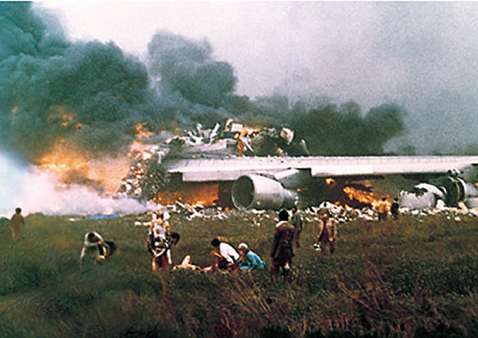

```{r setup, include=FALSE}
knitr::opts_chunk$set(echo = TRUE)
```

## Descripción

El conjunto de datos generado como parte de esta actividad práctica reúne diferentes características de accidentes de avión ocurridos a nivel mundial entre los años 1920 y 2017. Algunas de las variables que se recogen en el conjunto de datos son la fecha, la hora, la localización, el número de pasajeros o el de fallecidos.

## Imagen identificativa



## Contexto

Como se ha comentado, la materia del conjunto de datos se corresponde con accidentes de avión que han tenido lugar durante el último siglo en todo el mundo. Entre ellos pueden encontrarse accidentes de aviación de todo tipo: desde helicópteros militares o de transporte hasta aviones comerciales de pasajeros, pasando por todos aquellos que efectuaban maniobras de entrenamiento.

\newpage
## Contenido

Para cada accidente, el cual se corresponde con un registro en el conjunto de datos, se recogen las siguientes características:

* **Date**: día en el que tuvo lugar el accidente en el formato dd/mm/aaa.  
* **Time**: hora del accidente en formato de 24 horas.  
* **Location**: lugar del accidente.  
* **Latitude**: coordenada geográfica correspondiente a la latitud obtenida a partir de la localización y la librería *Geopy*.  
* **Longitude**: coordenada geográfica correspondiente a la longitud obtenida a partir de la localización y la librería *Geopy*.  
* **Operator**: nombre de la aerolínea o compañía de vuelos propietaria del avión o aviones involucrados en el accidente.  
* **Flight#**: número del vuelo.  
* **Route**: ruta prevista por los aviones implicados.  
* **ACType**: tipo de avión.  
* **Registration**: registro ICAO (International Civil Aviation Organization) del avión.  
* **cn/ln**: construcción o número de serie/línea o número de fuselaje.  
* **Aboard**: número total de personas a bordo (pasajeros + tripulación).  
* **Fatalities**: número de víctimas mortales.  
* **Ground**: número de fallecidos en tierra.  
* **Summary**: resumen del accidente.  
* **Reason**: causa del accidente. Constituye una categoría que se ha asignado en base al resumen aplicando técnicas de minería de textos (*Text Mining*).

Los autores de la web *PlaneCrashInfo* llevan recopilando información sobre estos accidentes desde el año 1997. Como fuentes de información utilizadas (listadas en este enlace: http://www.planecrashinfo.com/reference.htm) destacan periódicos, revistas y libros, entre otros.

## Agradecimientos

Los datos han sido recolectados desde la base de datos online [PlaneCrashInfo](http://www.planecrashinfo.com/database.htm). Para ello, se ha hecho uso del lenguaje de programación Python y de técnicas de *Web Scraping* para extraer la información alojada en las páginas HTML.

## Inspiración

El presente conjunto de datos podría utilizarse en ámbitos muy diversos. Uno de ellos podría ser en el periodístico, en el que disponer de los datos de la gran mayoría de accidentes de avión acontecidos en la historia podría valer para sacar a relucir aquellos que puedan resultar más interesante de cara a la realización de un reportaje.

También podría ser de gran utilidad en el campo de la *minería de datos*, a la hora de elaborar modelos predictivos (como por ejemplo árboles de decisión o redes neuronales). Así, se podría querer elaborar un modelo que permita predecir el número de víctimas mortales que podría ocasionar un avión en caso de accidente dadas las características del vuelo.

## Licencia

La licencia escogida para la publicación de este conjunto de datos ha sido **CC BY-SA 4.0 License**. Los motivos que han llevado a la elección de esta licencia tienen que ver con la idoneidad de las cláusulas que esta presenta en relación con el trabajo realizado:

* *Se debe proveer el nombre del creador del conjunto de datos generado, indicando los cambios que se han realizado*. De esta manera, se reconoce el trabajo ajeno y en qué medida se han realizado aportaciones en relación con el trabajo original.

* *Se permite un uso comercial*. Esto haría que incrementen las probabilidades de que una empresa utilice los datos generados y realicen trabajos de calidad que reporten cierto reconocimiento al autor original.

* *Las contribuciones realizadas a posteriori sobre el trabajo publicado bajo esta licencia deberán distribuirse bajo la misma*. Esto hace que el trabajo del autor original continúe distribuyéndose bajo los términos que él mismo planteó.

## Código fuente y dataset

Tanto el código fuente escrito para la extracción de datos como el dataset generado pueden ser accedidos a través de [este enlace](https://github.com/tteguayco/Web-scraping).

## Recursos

1. Lawson, R. (2015). Web Scraping with Python. Packt Publishing Ltd. Chapter 2. Scraping the Data  
2. Mitchel, R. (2015). Web Scraping with Python: Collecting Data from the Modern Web. O'Reilly Media, Inc. Chapter 1. Your First Web Scraper.